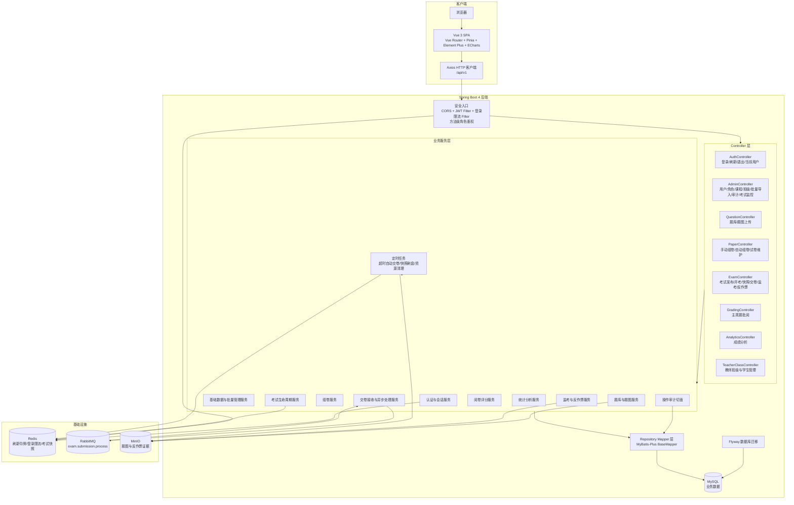
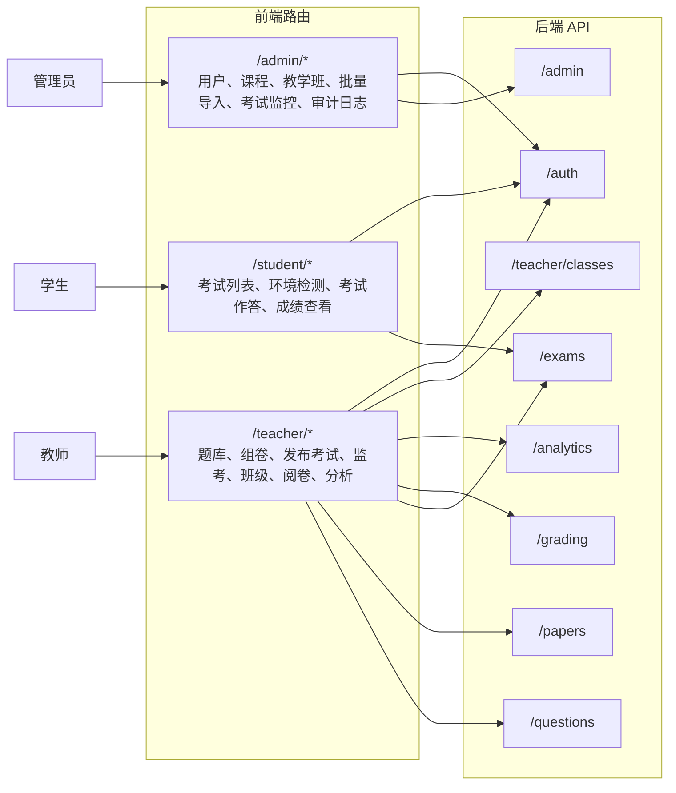
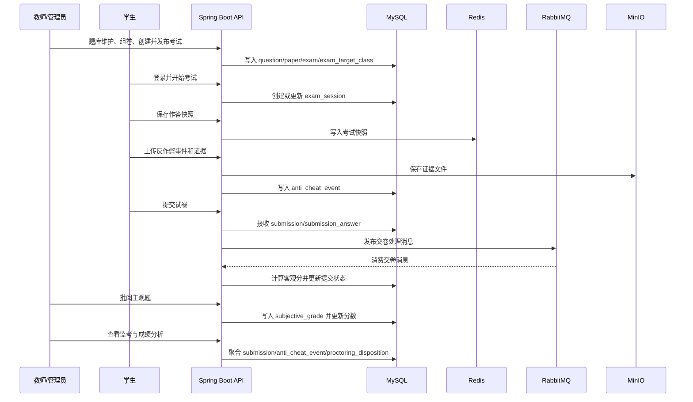
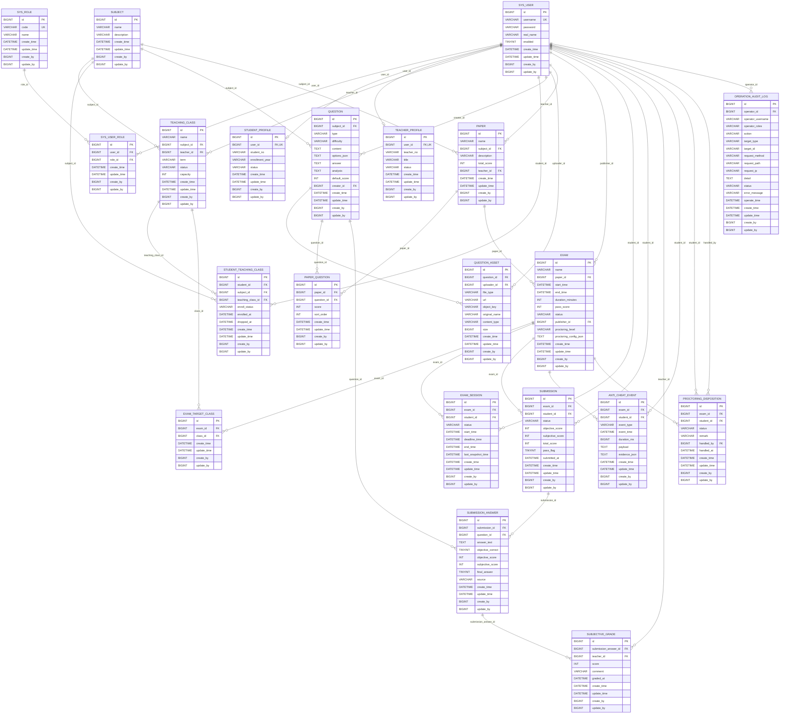

# 系统总体架构图与数据库 E-R 图

本文档基于当前代码与数据库迁移生成：

- 后端：`src/main/java/com/ekusys/exam`
- 前端：`src/main/resources/frontend/src`
- 运行期数据库结构：`src/main/resources/db/migration/V1__init.sql` 至 `V10__exam_proctoring_policy.sql`
- 配置：`src/main/resources/application.yaml`

> 说明：当前数据库迁移未声明数据库级 `FOREIGN KEY`，E-R 图中的 `FK` 为基于字段命名、唯一键、索引和服务调用推导出的逻辑外键关系。

## 系统总体架构图

## 角色与功能模块

## 核心考试链路

## 数据库 E-R 图

## 关系摘要

- 权限模型：`sys_user` 通过 `sys_user_role` 关联多个 `sys_role`，后端通过 Spring Security 的角色注解控制接口访问。
- 人员档案：学生、教师扩展信息分别落在 `student_profile`、`teacher_profile`，都与 `sys_user` 一对零或一。
- 教学组织：`subject`、`teaching_class`、`student_teaching_class` 共同表达课程、教学班、学生选课关系。
- 题库与试卷：`question` 归属课程，图片等附件存在 `question_asset`；`paper` 通过 `paper_question` 组合题目。
- 考试执行：`exam` 引用试卷，通过 `exam_target_class` 面向教学班发布；学生开始考试后产生 `exam_session`，交卷后形成 `submission` 与 `submission_answer`。
- 评分分析：客观题由交卷处理流程计算，主观题评分写入 `subjective_grade`，统计分析基于提交、答案、试卷和班级关系聚合。
- 监考反作弊：异常行为记录在 `anti_cheat_event`，证据文件存储在 MinIO，处置结果记录在 `proctoring_disposition`。
- 审计：带 `@AuditOperation` 的管理、题库、组卷、考试、阅卷等操作写入 `operation_audit_log`。

## 备注

- `schema.sql` 标注为 legacy reference，运行期以 Flyway 迁移为准。
- 代码中存在 `class_room`、`class_student` 两个遗留实体和 Mapper，但当前 Flyway 迁移未创建对应表，主流程已使用 `teaching_class` 与 `student_teaching_class`，因此未纳入运行期 E-R 图。
