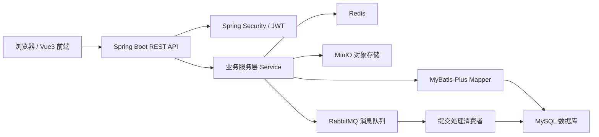
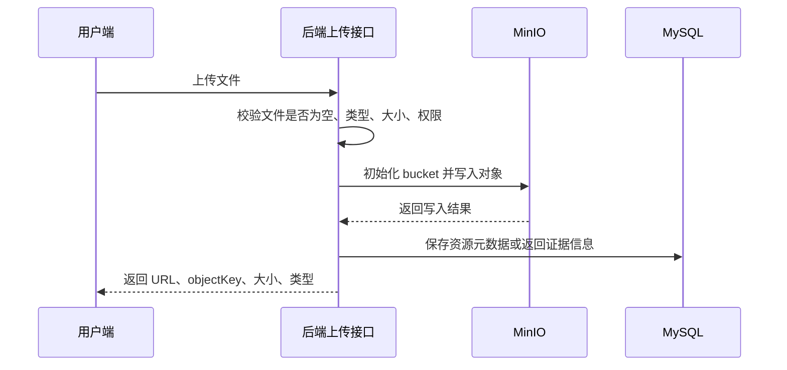
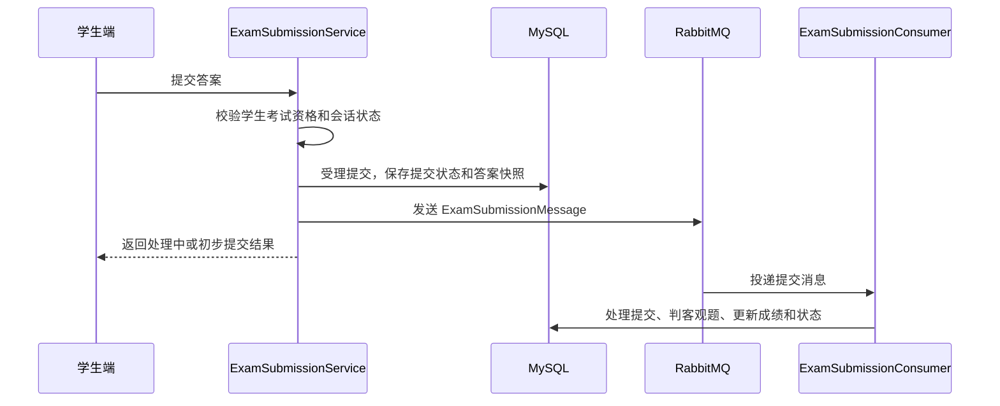

# “系统总体设计”章节结构化素材

> 说明：本文档仅提供论文写作素材，不直接生成最终论文正文。内容依据当前项目结构、配置文件、Controller/Service 分层、数据库迁移文件和前端目录整理。

## 1. 系统架构设计素材

### 1.1 总体架构定位

- 系统类型：基于 B/S 架构的在线考试系统。
- 前端技术：Vue 3，位于 `src/main/resources/frontend`，通过 Vite 构建。
- 后端技术：Spring Boot 4，Java 21，采用 RESTful API 对外提供服务。
- 数据访问：MyBatis-Plus + MySQL，数据库结构由 Flyway 迁移脚本管理。
- 安全认证：Spring Security + JWT，访问令牌放在请求头，刷新令牌通过 HttpOnly Cookie 保存。
- 缓存与临时状态：Redis 用于登录限流、答题快照缓存。
- 文件存储：MinIO 用于题目图片、反作弊证据图片等对象文件。
- 异步处理：RabbitMQ 用于考试提交后的异步判分和提交处理。
- 接口文档支持：项目引入 springdoc-openapi，可支持 Swagger/OpenAPI。

### 1.2 推荐写作中的架构图素材

### 1.3 后端分层结构素材

| 层次 | 主要包/目录 | 职责 |
| --- | --- | --- |
| 接口层 | `auth/controller`、`admin/controller`、`question/controller`、`paper/controller`、`exam/controller`、`grading/controller`、`analytics/controller`、`teacher/controller` | 接收 HTTP 请求、参数校验、权限注解控制、统一返回 `ApiResponse` |
| 业务层 | 各领域 `service` 包 | 封装认证、用户管理、题库、组卷、考试、监考、阅卷、统计分析等业务规则 |
| 数据访问层 | `repository/mapper` | 通过 MyBatis-Plus 操作数据库实体 |
| 数据模型层 | `repository/entity`、各领域 `dto` 包 | 实体类映射数据库表，DTO 承载请求和响应数据 |
| 公共支撑层 | `common/config`、`common/security`、`common/audit`、`common/exception`、`common/api` | 安全配置、JWT、限流、审计、异常处理、统一响应、MinIO/RabbitMQ/Redis 配置 |
| 前端表现层 | `frontend/src/views`、`router`、`stores`、`api` | 页面展示、路由控制、登录状态管理、调用后端接口 |

### 1.4 前端结构素材

| 前端目录 | 设计含义 |
| --- | --- |
| `api` | 封装 HTTP 请求和后端接口调用 |
| `router` | 前端路由配置 |
| `stores` | 登录用户状态、Token 等前端状态管理 |
| `layout` | 主布局组件 |
| `views/auth` | 登录页面 |
| `views/admin` | 管理员用户管理、课程管理、教学班管理、批量导入、考试监控、审计日志页面 |
| `views/teacher` | 教师题库、组卷、考试发布、班级管理、阅卷、统计分析、监考页面 |
| `views/student` | 学生考试列表、考前检测、答题、成绩查看页面 |
| `composables`、`utils` | 摄像头监考、考试草稿、本地工具函数等复用逻辑 |

## 2. 功能模块划分素材

### 2.1 后端业务模块划分

| 模块 | 主要控制器 | 主要服务类 | 主要职责 |
| --- | --- | --- | --- |
| 认证与会话模块 | `AuthController` | `AuthService`、`AuthCookieService`、`RefreshTokenSessionService`、`CustomUserDetailsService` | 登录、刷新令牌、退出、当前用户信息、用户认证信息加载 |
| 系统管理模块 | `AdminController` | `AdminService`、`UserAdminService`、`RoleAdminService`、`SubjectAdminService`、`TeachingClassAdminService` | 用户、角色、课程、教学班等基础数据管理 |
| 批量导入模块 | `AdminController` | `AdminBulkService`、`AdminCsvImportService` | 用户、教学班、考试安排的 CSV 批量导入和批量操作 |
| 教师班级模块 | `TeacherClassController` | `TeacherClassService` | 教师查看教学班、管理班级学生、查询可加入学生 |
| 题库管理模块 | `QuestionController` | `QuestionService`、`QuestionImageService`、`QuestionAssetCleanupService` | 题目增删改查、题图上传、题目资源清理 |
| 试卷管理模块 | `PaperController` | `PaperService` | 手动组卷、自动组卷、试卷查询、修改、删除 |
| 考试过程模块 | `ExamController` | `ExamService`、`ExamLifecycleService`、`ExamStartService`、`ExamSessionService`、`ExamSnapshotService`、`ExamSubmissionService` | 考试创建发布、考试列表、开始考试、答题快照、交卷、超时交卷 |
| 在线监考模块 | `ExamController` | `ExamProctoringService`、`ExamAntiCheatWriteService`、`ExamAntiCheatEvidenceService`、`ExamProctoringPolicyService` | 监考概览、学生风险列表、事件时间线、反作弊事件、证据上传、异常处置 |
| 阅卷评分模块 | `GradingController` | `GradingService` | 主观题待阅卷查询、单份评分、按题批量评分、重算总分 |
| 统计分析模块 | `AnalyticsController` | `AnalyticsService` | 成绩分布、考试概览、班级趋势、错题排行 |
| 审计日志模块 | `AdminController` | `OperationAuditLogService`、`OperationAuditLogQueryService`、`OperationAuditLogAspect` | 关键业务操作记录和查询 |

### 2.2 角色视角模块素材

| 角色 | 可用功能 |
| --- | --- |
| 管理员 | 用户管理、角色管理、课程管理、教学班管理、批量导入、考试监控、审计日志、题库/试卷/考试/阅卷/统计管理 |
| 教师 | 教学班学生管理、题库管理、试卷组卷、考试发布、在线监考、主观题阅卷、成绩分析 |
| 学生 | 查看可参加考试、考前环境检测、在线答题、保存答题快照、上报反作弊事件、提交考试、查看考试结果 |

## 3. 数据库设计素材

### 3.1 数据库设计原则

- 使用 MySQL 作为关系型数据库，保存用户、角色、题库、试卷、考试、提交、阅卷、监考等核心业务数据。
- 使用 Flyway 迁移脚本管理数据库版本，主要迁移文件位于 `src/main/resources/db/migration`。
- 使用 MyBatis-Plus 的 `assign_id` ID 策略生成主键。
- 多数表包含统一审计字段：`create_time`、`update_time`、`create_by`、`update_by`。
- 当前迁移脚本主要使用主键、唯一键和索引维护约束，未声明数据库级外键；业务关系通过逻辑外键和服务层校验维护。

### 3.2 数据表分组素材

| 数据表分组 | 数据表 | 对应业务 |
| --- | --- | --- |
| 用户权限表 | `sys_user`、`sys_role`、`sys_user_role` | 用户登录、身份认证、角色授权 |
| 用户档案与教学组织表 | `student_profile`、`teacher_profile`、`subject`、`teaching_class`、`student_teaching_class` | 学生/教师档案、课程、教学班、学生选课关系 |
| 题库与试卷表 | `question`、`question_asset`、`paper`、`paper_question` | 题目、题目资源、试卷、试卷题目明细 |
| 考试过程表 | `exam`、`exam_target_class`、`exam_session`、`submission`、`submission_answer` | 考试发布范围、答题会话、提交记录、答案明细 |
| 阅卷评分表 | `subjective_grade` | 主观题评分记录 |
| 监考反作弊表 | `anti_cheat_event`、`proctoring_disposition` | 异常事件、反作弊证据、异常处置 |
| 审计日志表 | `operation_audit_log` | 管理操作和关键业务操作审计 |

### 3.3 核心关系素材

| 关系 | 说明 |
| --- | --- |
| 用户与角色 | `sys_user` 与 `sys_role` 通过 `sys_user_role` 建立多对多关系 |
| 用户与学生/教师档案 | `student_profile.user_id`、`teacher_profile.user_id` 逻辑关联 `sys_user.id` |
| 教师与教学班 | `teaching_class.teacher_id` 逻辑关联教师用户 ID |
| 学生与教学班 | `student_teaching_class.student_id` 关联学生用户，`teaching_class_id` 关联教学班 |
| 课程与题目/试卷/教学班 | `subject.id` 被题目、试卷、教学班引用 |
| 试卷与题目 | `paper` 与 `question` 通过 `paper_question` 建立多对多关系，并记录题目分值和排序 |
| 考试与试卷 | `exam.paper_id` 指向 `paper.id` |
| 考试与教学班 | `exam` 与 `teaching_class` 通过 `exam_target_class` 建立发布范围关系 |
| 考试与学生作答 | `exam_session` 记录学生答题会话，`submission` 记录提交结果，`submission_answer` 记录答案明细 |
| 主观题评分 | `subjective_grade.submission_answer_id` 关联答案明细，`teacher_id` 关联阅卷教师 |
| 监考事件 | `anti_cheat_event` 关联考试和学生，记录异常类型、时间、持续时长和证据信息 |
| 监考处置 | `proctoring_disposition` 以考试和学生为唯一维度保存处置结果 |

### 3.4 可写入论文的数据库特点

- 业务数据按功能域拆分，减少单表职责过重。
- 中间表用于表达多对多关系，如用户角色、试卷题目、考试目标班级。
- 考试过程数据拆分为会话、提交、答案三层，便于支持断点续答、超时交卷、异步判分和主观题阅卷。
- 监考数据与考试提交数据分离，避免反作弊事件影响核心成绩数据结构。
- 操作审计独立成表，便于管理员追踪关键操作。

## 4. 权限设计素材

### 4.1 权限模型

- 采用基于角色的访问控制模型，系统角色包括 `ADMIN`、`TEACHER`、`STUDENT`。
- 用户登录后，后端生成包含用户 ID、用户名、角色列表、令牌类型和过期时间的 JWT。
- 前端访问业务接口时通过 `Authorization: Bearer <token>` 携带访问令牌。
- 后端 `JwtAuthenticationFilter` 解析访问令牌，并将用户身份写入 Spring Security 上下文。
- 刷新令牌通过 HttpOnly Cookie 保存，降低前端脚本直接读取刷新令牌的风险。
- Spring Security 开启方法级权限控制，Controller 使用 `@PreAuthorize` 限制接口访问角色。

### 4.2 权限控制层次

| 控制层次 | 实现位置 | 设计作用 |
| --- | --- | --- |
| 全局安全过滤链 | `SecurityConfig` | 关闭 CSRF、配置 CORS、设置无状态会话、注册限流过滤器和 JWT 过滤器 |
| 公开接口白名单 | `SecurityConfig` | 登录、刷新令牌、退出登录、健康检查、Swagger 文档允许匿名访问 |
| JWT 身份认证 | `JwtAuthenticationFilter`、`JwtTokenProvider` | 校验访问令牌合法性，解析用户和角色 |
| 方法级角色控制 | 各 Controller 的 `@PreAuthorize` | 控制管理员、教师、学生访问不同业务接口 |
| 业务级数据权限 | `ExamPermissionService`、`ExamAccessService`、各业务 Service | 控制教师只能管理自己发布或所教班级相关考试，学生只能访问自己有资格参加的考试 |
| 登录/刷新限流 | `AuthRateLimitFilter`、`AuthRateLimitService` | 通过 Redis 滑动窗口限制登录和刷新请求频率 |

### 4.3 角色权限矩阵素材

| 功能 | ADMIN | TEACHER | STUDENT |
| --- | --- | --- | --- |
| 用户、角色、课程、教学班基础数据管理 | 是 | 否 | 否 |
| 批量导入和批量操作 | 是 | 否 | 否 |
| 操作审计日志查询 | 是 | 否 | 否 |
| 考试监控汇总 | 是 | 否 | 否 |
| 题库管理 | 是 | 是 | 否 |
| 试卷管理 | 是 | 是 | 否 |
| 考试创建、发布、终止 | 是 | 是 | 否 |
| 教师教学班学生管理 | 是 | 是 | 否 |
| 在线监考和异常处置 | 是 | 是 | 否 |
| 主观题阅卷 | 是 | 是 | 否 |
| 成绩统计分析 | 是 | 是 | 否 |
| 查看考试列表、开始考试、答题、交卷 | 否 | 否 | 是 |
| 上传反作弊证据、上报异常事件 | 否 | 否 | 是 |
| 查看个人考试结果 | 否 | 否 | 是 |

### 4.4 可写入论文的安全设计要点

- 系统采用“认证 + 授权 + 业务数据权限”三层安全控制。
- JWT 适合前后端分离场景，减少服务器 Session 状态依赖。
- 刷新令牌与访问令牌区分，访问令牌有效期较短，刷新令牌用于续期。
- Redis 限流降低暴力登录和高频刷新请求风险。
- 管理类和关键业务类操作通过 AOP 记录审计日志。

## 5. 文件存储设计素材

### 5.1 文件存储组件

- 文件存储组件：MinIO。
- 配置项位置：`application.yaml` 的 `app.minio`。
- 主要配置：`endpoint`、`public-endpoint`、`access-key`、`secret-key`、`bucket`、`public-read`。
- 默认 bucket：`question-images`。

### 5.2 文件类型与用途

| 文件类型 | 上传入口 | 存储用途 | 数据库记录 |
| --- | --- | --- | --- |
| 题目图片/资源 | `QuestionController` 的 `/api/v1/questions/images/upload` | 题干配图、视频或附件等题目资源 | `question_asset` 保存 `url`、`object_key`、`original_name`、`content_type`、`size`、`uploader_id`、`question_id` |
| 反作弊证据图片 | `ExamController` 的 `/api/v1/exams/{examId}/anti-cheat-evidence` | 保存屏幕或摄像头证据截图 | 上传接口返回 URL 和对象键，后续可通过 `anti_cheat_event.evidence_json` 与异常事件关联 |

### 5.3 对象路径设计

| 场景 | 对象键设计 |
| --- | --- |
| 题目资源 | `question/yyyy/MM/dd/{uuid}.{ext}` |
| 反作弊证据 | `proctoring/{examId}/{studentId}/yyyy/MM/dd/{eventType}-{source}-{uuid}.{ext}` |

### 5.4 文件存储流程素材

### 5.5 清理与访问设计

- 系统在 `QuestionAssetCleanupScheduler` 中支持启动时和定时清理。
- 清理配置位于 `app.asset-cleanup`，包括是否启用、启动时是否执行、清理间隔、孤儿资源宽限时间、MinIO 前缀。
- `QuestionAssetUrlResolver` 根据 `public-endpoint` 生成可访问 URL。
- 如果 `public-read` 为 `true`，系统初始化 bucket 时设置公开读取策略。

## 6. 消息队列设计素材

### 6.1 使用 RabbitMQ 的目的

- 考试交卷后需要写入提交记录、答案明细、计算客观题得分、更新提交状态。
- 如果所有处理都在 HTTP 请求线程中同步完成，可能增加交卷接口响应时间。
- 系统使用 RabbitMQ 将“提交受理”和“提交处理”解耦，提高交卷接口响应速度和系统抗峰值能力。

### 6.2 消息队列配置

| 配置项 | 默认值 | 说明 |
| --- | --- | --- |
| 交换机 | `exam.submission.exchange` | 考试提交处理交换机 |
| 队列 | `exam.submission.process.queue` | 考试提交处理队列 |
| 路由键 | `exam.submission.process` | 绑定交换机和处理队列 |
| 死信交换机 | `exam.submission.dlx` | 处理失败后的死信交换机 |
| 死信队列 | `exam.submission.process.dlq` | 处理失败后的死信队列 |
| 消息格式 | JSON | 通过 `Jackson2JsonMessageConverter` 序列化消息 |
| 重试策略 | 最多 3 次 | `RetryInterceptorBuilder.stateless().maxRetries(3)` |

### 6.3 提交消息结构

| 字段 | 含义 |
| --- | --- |
| `submissionId` | 提交记录 ID |
| `examId` | 考试 ID |
| `studentId` | 学生用户 ID |
| `submittedAt` | 提交时间 |
| `timeoutSubmit` | 是否为超时自动提交 |

### 6.4 交卷异步处理流程素材

### 6.5 容错设计素材

- 消息发布失败时，`ExamSubmissionService` 会回退到同步处理，避免因消息队列不可用导致交卷失败。
- 消费者通过 `@RabbitListener` 监听处理队列。
- 消费失败时不默认重新入队，避免无限重试。
- 监听容器配置了最多 3 次重试，重试后进入死信处理路径。
- 提交消息只传递必要 ID 和上下文，不传输完整答案内容，核心答案数据仍保存在数据库中。

## 7. 答题快照与缓存设计素材

### 7.1 Redis 使用场景

| 场景 | Key 设计 | 说明 |
| --- | --- | --- |
| 答题快照 | `exam:snapshot:{examId}:{studentId}` | 保存学生答题过程中的临时答案 |
| 登录/刷新限流 | `auth:rate-limit:{action}:{clientIp}` | 使用 Redis ZSet + Lua 脚本实现滑动窗口限流 |

### 7.2 快照落库设计

- 学生答题过程中调用快照接口，答案先以 JSON 形式写入 Redis。
- 快照 TTL 根据考试结束时间和配置的兜底时长计算。
- `SnapshotFlushScheduler` 定时扫描 `exam:snapshot:*`，将仍处于 `IN_PROGRESS` 状态的草稿答案写入 `submission_answer`。
- 正式提交时优先合并数据库草稿和 Redis 快照，避免丢失最近一次保存的答案。

### 7.3 设计价值

- 减少高频答题保存对 MySQL 的直接写入压力。
- 支持浏览器刷新或异常退出后的断点续答。
- 定时落库提升数据可靠性，避免 Redis 临时数据丢失造成答案完全不可恢复。

## 8. 可用于论文小结的设计要点

- 系统整体采用前后端分离的 B/S 架构，后端按领域拆分模块，前端按用户角色拆分页面。
- 数据库围绕用户、课程班级、题库试卷、考试提交、监考阅卷、审计日志建立核心数据模型。
- 权限体系采用 RBAC，并结合业务数据权限控制考试、班级和阅卷数据访问范围。
- 文件类数据不直接存入数据库，而是存储在 MinIO 中，数据库仅保存文件元数据和访问地址。
- 考试提交采用 RabbitMQ 异步处理，提高交卷接口响应能力，并通过失败回退和死信机制提升可靠性。
- Redis 同时承担答题快照缓存和认证限流职责，兼顾用户体验与系统安全性。
- 操作审计通过 AOP 实现，降低业务代码侵入性，同时满足管理员追踪关键操作的需求。

